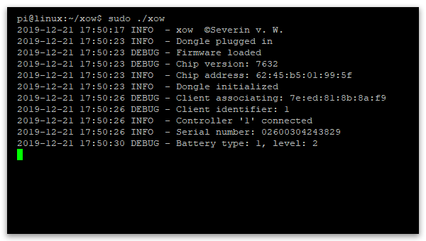

# xow [](https://travis-ci.com/medusalix/xow) [](https://github.com/medusalix/xow/releases/latest) [](https://www.paypal.com/cgi-bin/webscr?cmd=_s-xclick&hosted_button_id=PLN6F3UGS37DE&lc=US)

<p align="center">
  
</p>

xow is a Linux user mode driver for the Xbox One wireless dongle.
It communicates with the dongle via `libusb` and provides joystick input through the `uinput` kernel module.
The input mapping is based on existing kernel drivers like [xpad](https://github.com/paroj/xpad).

**NOTE:** xow is still at a **VERY EARLY** stage of development. Do not be surprised if it does not work *at all*.
In case of problems, please open an issue with all the relevant details (dongle version, controller version, logs, captures, etc.) and I will see what I can do.

## Supported devices

xow supports both versions of the wireless dongle (slim and bulky one).
The following Xbox One controllers are currently compatible with the driver:

| Model number | Year | Additional information  | Status       |
|--------------|------|-------------------------|--------------|
| 1537         | 2013 | Original controller     | **Broken**   |
| 1697         | 2015 | Added audio jack        | **Working**  |
| 1698         | 2015 | Elite controller        | **Working**  |
| 1708         | 2016 | Bluetooth functionality | **Working**  |
| ????         | 2019 | Elite controller 2      | **Untested** |

## Planned features

#### Make controller's LEDs and power settings accessible

Ideally, other applications should be able to query/set these things.

#### Automatic channel selection

The Windows driver goes through all channels and reads `MT_CH_IDLE` and `MT_CH_BUSY` to select the best one.
I have not figured out what these values are and how they are used to determine the least noisy channel.

Any **help/suggestions** regarding the planned features is much appreciated.

## Releases

- [Arch Linux](https://aur.archlinux.org/packages/xow-git)

Feel free to create prebuilt releases of xow for any package repository you like.
Ideally, I would like to provide binaries for every major Linux distribution.

## Building

Clone the repository (necessary for version tagging to work):

```
git clone https://github.com/medusalix/xow
```

Make sure that `libusb` is installed on your machine. You can build xow using the following command:

```
make BUILD=RELEASE
```

**NOTE:** Please use `BUILD=DEBUG` when asked for your debug logs.

**Option 1 (recommended):** Install xow as a `systemd` service (starts xow at boot time):

```
sudo make install
sudo systemctl enable xow
sudo systemctl start xow
```

**Option 2:** Run xow manually:

```
sudo ./xow
```

Running xow without `make install` is **not recommended** (except for debugging) as it requires root privileges to operate.

## Troubleshooting

- Buttons/triggers/sticks are mapped incorrectly
    - Try the options listed on [this page](https://wiki.archlinux.org/index.php/Gamepad#Setting_up_deadzones_and_calibration) to remap your inputs.
- Input from the sticks is jumping around
    - Try the options listed on [this page](https://wiki.archlinux.org/index.php/Gamepad#Setting_up_deadzones_and_calibration) to set your deadzones.
- Controller does not connect to the dongle
    - See [supported devices](#supported-devices). Do a packet capture and open an issue.

**NOTE:** Please refrain from opening issues concerning input remapping, deadzones or game compatibility, as these topics are outside the scope of this project.

## How it works

The dongle's wireless chip (MT76xx) handles the WLAN connection with individual controllers.
The packet format follows Microsoft's undisclosed GIP (Game Input Protocol) specification.
Most of the reverse engineering was done by capturing the communication between the dongle and a Windows PC using [`Wireshark`](https://www.wireshark.org).
As no datasheets for this chip are publicly available, I have used datasheets of similar wireless radios for assistance.
Special thanks to the authors of Linux' [`mt76`](https://github.com/torvalds/linux/tree/master/drivers/net/wireless/mediatek/mt76) kernel driver.
It would have been impossible for me to create this driver without `mt76`'s source code.
If anyone has a greater understanding of the GIP or the weird quirks I had to add to make the driver work (like `initGain`), please contact me.

## License

xow is released under the [GNU General Public License, Version 2](LICENSE).

```
Copyright (C) 2019 Medusalix

This program is free software; you can redistribute it and/or
modify it under the terms of the GNU General Public License
as published by the Free Software Foundation; either version 2
of the License, or (at your option) any later version.
```

The included `firmware.bin` file, extracted from the Windows drivers, is provided under a [special proprietary license](LICENSE-FIRMWARE).
