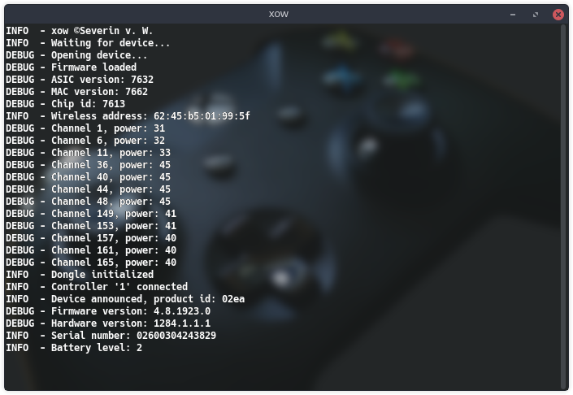

<p align="center">
    
</p>

<p align="center">
    <a href="https://github.com/medusalix/xow/actions">
        
    </a>
    <a href="https://github.com/medusalix/xow/releases/latest">
        
    </a>
    <a href="https://discord.gg/FDQxwWk">
        
    </a>
    <a href="https://www.paypal.com/cgi-bin/webscr?cmd=_s-xclick&hosted_button_id=PLN6F3UGS37DE&lc=US">
        
    </a>
</p>

<p align="center">
  
</p>

# The future of this project

I realize there have not been any substantial changes to xow in over a year now. This is partly due to the lack of free time for me as a university student. I thought about the numerous feature requests and long-standing bugs and finally decided to abandon the concept of a user mode driver. While it certainly proved a point it also demonstrated how quickly you reach the boundaries of integration with other parts of the operating system (audio, battery reporting, etc.).
I have been working on a new kernel driver for the last couple of months and it already works pretty well. It is currently USB-only and support for the wireless dongle will be added later on. It has **audio functionality**, **battery reporting** and support for the **chatpad**. **If you would like to give it a try you can head over to the [Discord server](https://discord.gg/FDQxwWk). Feedback is much appreciated!**

## About

xow is a Linux user mode driver for the Xbox One wireless dongle.
It communicates with the dongle via `libusb` and provides joystick input through the `uinput` kernel module.
The input mapping is based on existing kernel drivers like [xpad](https://github.com/paroj/xpad).

## Important notes

The Xbox One wireless dongle requires a proprietary firmware to operate.
The firmware is included with the *Xbox - Net - 7/11/2017 12:00:00 AM - 1.0.46.1* driver available from *Microsoft Update Catalog*.
The package is automatically downloaded and extracted during the build process due to Microsoft's [Terms of Use](https://www.microsoft.com/en-us/legal/intellectualproperty/copyright/default.aspx), which strictly disallow the distribution of the firmware.
**By using xow, you accept Microsoft's license terms for their driver package.**

## Supported devices

xow supports both versions of the wireless dongle (slim and bulky one) and the Surface Book 2's built-in adapter.
The following Xbox One controllers are currently compatible with the driver:

| Model number | Year | Additional information    | Status       |
|--------------|------|---------------------------|--------------|
| 1537         | 2013 | Original controller       | **Working**  |
| 1697         | 2015 | Audio jack                | **Working**  |
| 1698         | 2015 | Elite controller          | **Working**  |
| 1708         | 2016 | Bluetooth connectivity    | **Working**  |
| 1797         | 2019 | Elite controller series 2 | **Working**  |
| 1914         | 2020 | Share button and USB-C    | **Untested** |

## Releases

### Linux distributions

[](https://repology.org/project/xow/versions)

- [RPM packaging instructions](https://gitlab.com/yajoman/xow-rpm) (for distributions like Fedora)

### Third-party hardware

- EmuELEC (starting with [version 3.3](https://github.com/EmuELEC/EmuELEC/releases/tag/v3.3))
- GamerOS (starting with [version 13](https://github.com/gamer-os/gamer-os/releases/tag/13))
- Steam Link (starting with [build 747](https://steamcommunity.com/app/353380/discussions/0/1735510154204276395))

Feel free to package xow for any Linux distribution or hardware you like, as long as you do not publish any prebuilt executables.
The build process embeds a copy of Microsoft's proprietary firmware into the binary, prohibiting any type of distribution.
Any issues regarding the packaging should be reported to the respective maintainers.

## Installation

### Prerequisites

- Linux (kernel 4.5 or newer)
- curl (for proprietary driver download)
- cabextract (for firmware extraction)
- libusb (libusb-1.0-0-dev for Debian)
- systemd (version 232 or newer)

Clone the repository (necessary for version tagging to work):

```
git clone https://github.com/medusalix/xow
```

Build xow using the following command:

```
make BUILD=RELEASE
```

**NOTE:** Please use `BUILD=DEBUG` when asked for your debug logs.

Install xow as a `systemd` unit (runs xow at boot time) and start the service:

```
sudo make install
sudo systemctl enable xow
sudo systemctl start xow
```

**NOTE:** Running xow manually is **strongly discouraged**. A reboot might be required for xow to work correctly.

### Updating

Make sure to completely uninstall xow before updating:

```
sudo systemctl stop xow
sudo systemctl disable xow
sudo make uninstall
```

## Interoperability

You can enable the dongle's pairing mode by sending the `SIGUSR1` signal to xow:

```
sudo systemctl kill -s SIGUSR1 xow
```

**NOTE:** Signals are only handled *after* a dongle has been plugged in. The default behavior for `SIGUSR1` is to terminate the process.

## Troubleshooting

### Error messages

- `InputException`: No such file or directory
    - The `/dev/uinput` device has to be available. The `uinput` kernel module needs to be loaded.
- `InputException`: Permission denied
    - The permissions for `/dev/uinput` have to allow read and write access. The `udev` rules need to be installed and any conflicts with existing rules have to be resolved.
- `Mt76Exception`: Failed to load firmware
    - Another driver might have already loaded the dongle's firmware. The dongle needs to be unplugged to reset its internal memory, followed by a restart of xow's `systemd` service.
- `LIBUSB_ERROR_TIMEOUT`
    - See the [USB incompatibilities](#usb-incompatibilities) section.
- `LIBUSB_ERROR_BUSY` or `LIBUSB_ERROR_NO_DEVICE`
    - Only a single program can communicate with the dongle at once. Any existing drivers that might interfere with xow need to be disabled. This includes running multiple instances of xow.
- `LIBUSB_ERROR_ACCESS`
    - The permissions for the dongle's USB device have to be set correctly. This is also handled by the `udev` rules.

Using an outdated version of `libusb` can cause various issues. Make sure to update `libusb` to the latest version.

### Pairing problems

The controller only remembers the *last* device it was connected to. It will not automatically establish a connection to the dongle if it was previously plugged into a USB port or paired via bluetooth, even if the same computer was used.

### Configuration issues

- Certain games do not detect wireless controllers
    - Enable the *compatibility mode* in the service configuration, reload the `systemd` daemon and restart the service.
    Controllers connected to the dongle will appear as Xbox 360 controllers.
- Buttons/triggers/sticks are mapped incorrectly
    - Try the options listed on [this page](https://wiki.archlinux.org/index.php/Gamepad#Setting_up_deadzones_and_calibration) to remap your inputs.
- Input from the sticks is jumping around
    - Try the options listed on [this page](https://wiki.archlinux.org/index.php/Gamepad#Setting_up_deadzones_and_calibration) to set your deadzones.

### USB incompatibilities

Some USB controllers are known to cause issues with xow. Plugging your dongle into a USB port that uses an `ASMedia` controller will lead to problems. Most `Intel` USB controllers work well with xow.
Power management issues can arise when using a USB 3 controller. These can lead to timeouts of the USB communication. The use of a USB hub can mitigate these problems.

### Controller periodically disconnects (when idle)
Some controllers might periodically disconnect due to xow receiving an empty packet (which should not happen for most controllers).
This usually happens when the controller is not receiving any input, but can still happen when being used.
As a result, you can disable the automatic disconnect when building by using the `EMPTY_PACKET_DISCONNECT` flag as shown below:

```
make BUILD=RELEASE EMPTY_PACKET_DISCONNECT=0
```

### Other problems

In case of any other problems, please open an issue with all the relevant details (dongle version, controller version, logs, captures, etc.).

**NOTE:** Please refrain from creating issues concerning input remapping, deadzones or game compatibility as these topics are outside the scope of this project.

## How it works

The dongle's wireless chip (MT76xx) handles the WLAN connection with individual controllers.
The packet format follows Microsoft's undisclosed GIP (Game Input Protocol) specification.
Most of the reverse engineering was done by capturing the communication between the dongle and a Windows PC using [`Wireshark`](https://www.wireshark.org).
As no datasheets for this chip are publicly available, I have used datasheets of similar wireless radios for assistance.
Special thanks to the authors of OpenWrt's [`mt76`](https://github.com/openwrt/mt76) kernel driver.
It would have been impossible for me to create this driver without `mt76`'s source code.
If anyone has a greater understanding of the GIP or the weird quirks I had to add to make the driver work, please contact me.

## License

xow is released under the [GNU General Public License, Version 2](LICENSE).

```
Copyright (C) 2019 Medusalix

This program is free software; you can redistribute it and/or
modify it under the terms of the GNU General Public License
as published by the Free Software Foundation; either version 2
of the License, or (at your option) any later version.
```
